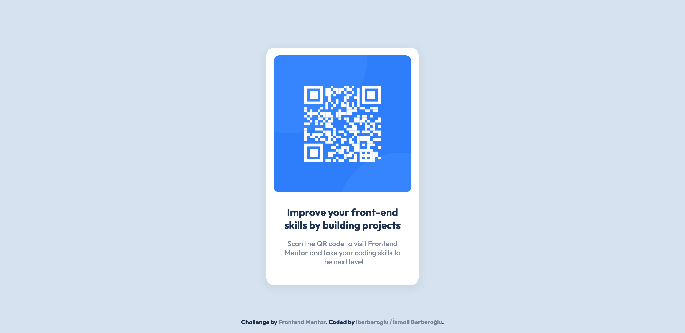

This is a solution to the [QR code component challenge on Frontend Mentor](https://www.frontendmentor.io/challenges/qr-code-component-iux_sIO_H). Frontend Mentor challenges help you improve your coding skills by building realistic projects.

[Preview](https://iberberoglu-qr-code-component.netlify.app/)

### Screenshot

- Frontend Mentor - [@iberberoglu](https://www.frontendmentor.io/profile/iberberoglu)
- Twitter - [@iberberoglu](https://www.twitter.com/iberberoglu)

